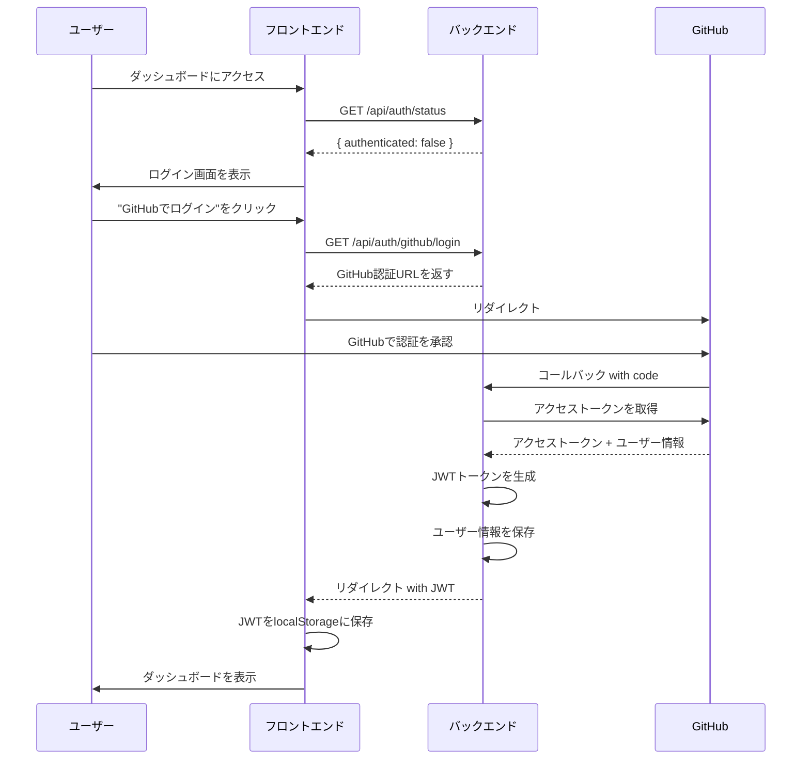
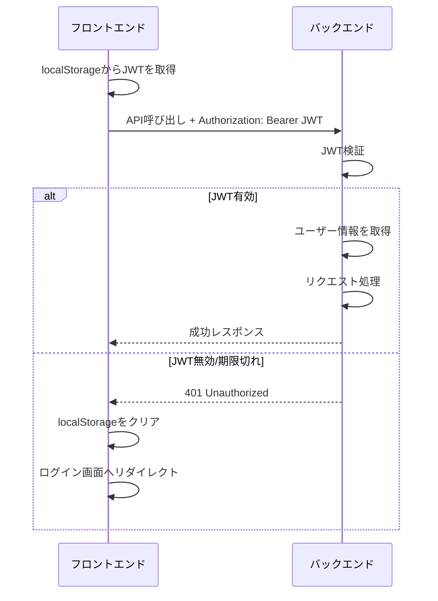

# 認証システム設計書

## 1. 概要

このドキュメントでは、LPlampプロジェクトの認証システムの詳細設計を定義します。初期バージョンは個人利用を前提としたシンプルな構成とし、将来的なSaaS化に対応できる拡張可能な設計とします。

### 1.1 設計方針

- **シンプルさ優先**: GitHub OAuth認証のみを使用
- **個人利用前提**: 複雑な権限管理は実装しない
- **拡張可能性**: 将来のマルチユーザー対応を考慮したデータ構造
- **セキュリティ**: Codespacesでの安全な認証情報管理

## 2. 認証メカニズム

### 2.1 選定方式

**GitHub OAuth 2.0 + JWT（JSON Web Token）**

- GitHub OAuth 2.0: ユーザー認証
- JWT: セッション管理とAPI認証

### 2.2 選定理由

1. **GitHub統合の必然性**
   - プロジェクトのエクスポート先がGitHub
   - Codespacesでの開発環境
   - 開発者向けツールとしての親和性

2. **JWTの利点**
   - ステートレスなセッション管理
   - フロントエンド/バックエンド分離に最適
   - 将来のマイクロサービス化に対応可能

3. **実装の容易さ**
   - GitHub OAuthは実装が簡単
   - パスワード管理が不要
   - ユーザー情報の自動取得

## 3. 認証フロー

### 3.1 初回認証フロー



### 3.2 API呼び出しフロー



### 3.3 トークン更新フロー

初期バージョンでは、シンプルさを優先してリフレッシュトークンは実装しません。
JWTの有効期限は30日とし、期限切れ時は再ログインを求めます。

## 4. セキュリティ対策

### 4.1 JWT管理

- **保存場所**: localStorage（HttpOnly Cookieは将来実装）
- **有効期限**: 30日
- **署名アルゴリズム**: HS256
- **秘密鍵**: 環境変数 `JWT_SECRET` で管理

### 4.2 GitHub OAuth設定

- **Client ID**: 環境変数 `GITHUB_CLIENT_ID`
- **Client Secret**: 環境変数 `GITHUB_CLIENT_SECRET`（Codespaces Secretsで管理）
- **コールバックURL**: 開発環境と本番環境で切り替え

### 4.3 CORS設定

- 開発環境: `http://localhost:3000` を許可
- 本番環境: 明示的にフロントエンドのドメインのみ許可

### 4.4 レート制限

- ログイン試行: 同一IPから5回/分まで
- API呼び出し: 認証済みユーザーは100リクエスト/分

## 5. データモデル

### 5.1 User エンティティ

```typescript
interface User {
  id: string;                    // UUID
  githubId: string;              // GitHub user ID
  username: string;              // GitHub username
  email: string | null;          // GitHub email
  avatarUrl: string | null;      // GitHub avatar URL
  accessToken: string;           // GitHub access token (暗号化)
  createdAt: string;             // ISO 8601
  updatedAt: string;             // ISO 8601
  lastLoginAt: string;           // ISO 8601
}
```

### 5.2 セッション情報（JWT Payload）

```typescript
interface JWTPayload {
  sub: string;        // User ID
  githubId: string;   // GitHub ID
  username: string;   // GitHub username
  iat: number;        // 発行時刻
  exp: number;        // 有効期限
}
```

## 6. コード構造とアーキテクチャガイドライン

### 6.1 バックエンド認証モジュール構成

```
backend/src/features/auth/
├── auth.controller.ts      # 認証エンドポイントのハンドラー
├── auth.service.ts         # 認証ロジック（GitHub連携、JWT生成）
├── auth.routes.ts          # ルート定義
├── auth.middleware.ts      # JWT検証ミドルウェア
├── auth.validator.ts       # 入力検証
└── auth.types.ts           # 認証固有の型定義
```

### 6.2 フロントエンド認証管理

```
frontend/src/features/auth/
├── AuthContext.tsx         # 認証状態のグローバル管理
├── services/
│   ├── authService.ts      # 認証API呼び出し
│   └── tokenService.ts     # JWT管理（保存、取得、削除）
├── hooks/
│   └── useAuth.ts          # 認証状態と操作のカスタムフック
└── components/
    ├── LoginPage.tsx       # ログイン画面
    └── ProtectedRoute.tsx  # 認証が必要なルートの保護
```

### 6.3 認証ミドルウェアの実装

```typescript
// auth.middleware.ts
export function requireAuth(req: Request, res: Response, next: NextFunction) {
  const token = req.headers.authorization?.split(' ')[1];
  
  if (!token) {
    return res.status(401).json({ 
      error: '認証が必要です', 
      code: 'AUTH_REQUIRED' 
    });
  }
  
  try {
    const payload = jwt.verify(token, process.env.JWT_SECRET!) as JWTPayload;
    req.user = {
      id: payload.sub,
      githubId: payload.githubId,
      username: payload.username
    };
    next();
  } catch (error) {
    return res.status(401).json({ 
      error: 'トークンが無効です', 
      code: 'INVALID_TOKEN' 
    });
  }
}
```

## 7. 環境設定

### 7.1 必要な環境変数

```bash
# GitHub OAuth
GITHUB_CLIENT_ID=your_github_app_client_id
GITHUB_CLIENT_SECRET=your_github_app_client_secret
GITHUB_CALLBACK_URL=http://localhost:8080/api/auth/github/callback

# JWT設定
JWT_SECRET=your_jwt_secret_key
JWT_EXPIRES_IN=30d

# アプリケーション設定
FRONTEND_URL=http://localhost:3000
```

### 7.2 GitHub OAuth App設定

1. GitHub Settings > Developer settings > OAuth Apps で新規作成
2. Application name: "LPlamp"
3. Homepage URL: `http://localhost:3000`（開発環境）
4. Authorization callback URL: `http://localhost:8080/api/auth/github/callback`

## 8. APIエンドポイント

### 8.1 認証関連エンドポイント

| メソッド | パス | 説明 | 認証要否 |
|---------|------|------|----------|
| GET | `/api/auth/status` | 認証状態確認 | 不要 |
| GET | `/api/auth/github/login` | GitHub認証開始 | 不要 |
| GET | `/api/auth/github/callback` | GitHub認証コールバック | 不要 |
| POST | `/api/auth/logout` | ログアウト | 必要 |
| GET | `/api/auth/me` | 現在のユーザー情報取得 | 必要 |

### 8.2 エラーレスポンス

```typescript
// 401 Unauthorized
{
  "error": "認証が必要です",
  "code": "AUTH_REQUIRED"
}

// 403 Forbidden（将来の拡張用）
{
  "error": "この操作を実行する権限がありません",
  "code": "PERMISSION_DENIED"
}
```

## 9. 将来の拡張ポイント

### 9.1 SaaS化に向けた準備

1. **Organization（組織）テーブルの追加**
   - ユーザーを組織に紐付け
   - 組織単位での課金管理

2. **Role（ロール）システムの追加**
   - ADMIN, USER, GUEST などのロール
   - ロールベースアクセス制御（RBAC）

3. **プロジェクト共有機能**
   - ProjectShare テーブルの追加
   - 共有権限レベルの管理

### 9.2 セキュリティ強化

1. **リフレッシュトークンの実装**
   - アクセストークンの有効期限短縮（15分）
   - リフレッシュトークンでの自動更新

2. **HttpOnly Cookie**
   - JWTをCookieで管理
   - XSS攻撃への対策強化

3. **2要素認証**
   - GitHubの2FA連携
   - 追加のセキュリティレイヤー

## 10. 実装優先順位

1. **Phase 1（必須）**
   - GitHub OAuth認証フロー
   - JWT生成と検証
   - 認証ミドルウェア
   - ユーザー情報の保存と取得

2. **Phase 2（推奨）**
   - レート制限
   - エラーハンドリングの改善
   - 認証状態の永続化

3. **Phase 3（将来）**
   - リフレッシュトークン
   - 組織・ロール管理
   - プロジェクト共有機能