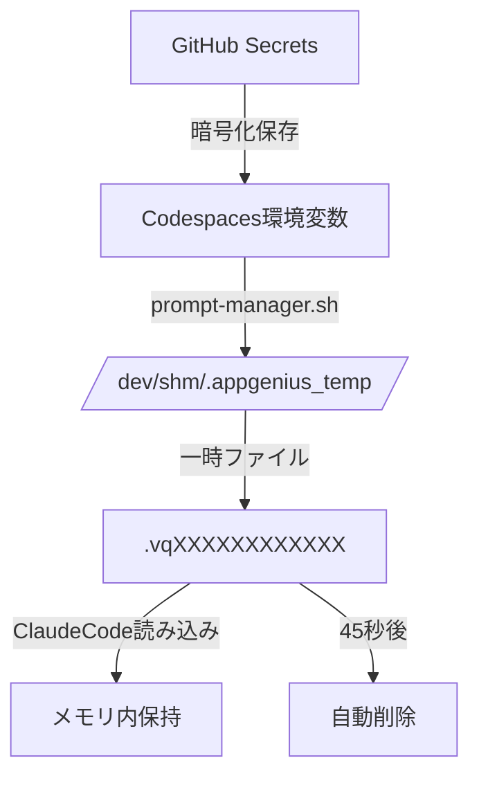

# LPlamp セキュリティ設定ガイド

## 概要

LPlampは、AIエージェントのプロンプトを機密情報として扱い、GitHub Secretsを使用して安全に管理します。このガイドでは、セキュリティ設定の手順を説明します。

## GitHub Secretsの設定

### 1. リポジトリのSecrets設定へアクセス

1. GitHubでLPlampリポジトリを開く
2. Settings → Secrets and variables → Codespaces
3. 「New repository secret」をクリック

### 2. プロンプトSecretの作成

**Secret名**: `LPGENIUS_PROMPT_SECRET`

**Secret値**: 精密差し替えエージェントのプロンプト全文を貼り付け

```
# 精密差し替えエージェント - AIR Design → BlueLamp変換専門

## 役割と目的
私は「精密差し替えエージェント」として...
[プロンプトの全文]
```

### 3. Codespacesへの反映

1. 既存のCodespacesがある場合は再起動
2. 新規Codespacesを作成する場合は自動的に反映

## セキュリティ機能の仕組み

### プロンプト管理フロー



### セキュリティ対策

1. **暗号化保存**: GitHub Secretsで暗号化
2. **メモリ上保存**: `/dev/shm`（RAM）使用でディスク書き込みなし
3. **アクセス制限**: chmod 600（所有者のみ）
4. **自動削除**: 45秒後に確実に削除
5. **プロセス終了時削除**: trapによる確実なクリーンアップ

## 動作確認

### 1. 環境変数の確認

```bash
# Codespaces内で実行
echo ${LPGENIUS_PROMPT_SECRET:0:20}... # 最初の20文字のみ表示
```

### 2. プロンプト管理スクリプトのテスト

```bash
# スクリプトの実行権限付与
chmod +x scripts/security/prompt-manager.sh

# テスト実行
./scripts/security/prompt-manager.sh
```

期待される出力:
```
[prompt-manager] INFO: プロンプトファイルを作成しています: /dev/shm/.appgenius_temp/.vqXXXXXXXXXXXX
[prompt-manager] INFO: プロンプトファイル作成完了 (サイズ: XXXX バイト)
[prompt-manager] INFO: 自動削除タイマー開始 (45秒後に削除, PID: XXXXX)
/dev/shm/.appgenius_temp/.vqXXXXXXXXXXXX
[prompt-manager] INFO: プロンプト管理完了
```

### 3. ClaudeCode統合の確認

1. LPlampを起動
2. エディターでプロジェクトを開く
3. ClaudeCodeターミナルで以下を確認:
   - 「🤖 精密差し替えエージェントプロンプトを読み込みました」のメッセージ
   - プロンプトに従った動作

## トラブルシューティング

### プロンプトが読み込まれない場合

1. **環境変数確認**
   ```bash
   env | grep LPGENIUS_PROMPT_SECRET
   ```

2. **スクリプト権限確認**
   ```bash
   ls -la scripts/security/prompt-manager.sh
   ```

3. **ログ確認**
   - バックエンドログでプロンプト関連のメッセージを確認
   - 「LPGENIUS_PROMPT_SECRET環境変数が設定されていません」
   - 「プロンプト管理スクリプトが見つかりません」

### セキュリティベストプラクティス

1. **プロンプト内容の取り扱い**
   - プロンプト内容をログに出力しない
   - エラーメッセージにプロンプト内容を含めない
   - デバッグ時もプロンプト内容を表示しない

2. **定期的な更新**
   - プロンプトを更新する際はGitHub Secretsを更新
   - Codespacesを再起動して反映

3. **アクセス管理**
   - リポジトリのアクセス権限を適切に管理
   - Codespaces Secretsへのアクセスを制限

## 関連ドキュメント

- [Codespaces セットアップガイド](./setup-guide.md)
- [リファクタリング計画](../refactoring/codespaces-migration-2025-01-09.md)
- [要件定義書](../requirements.md) - セクション7.5